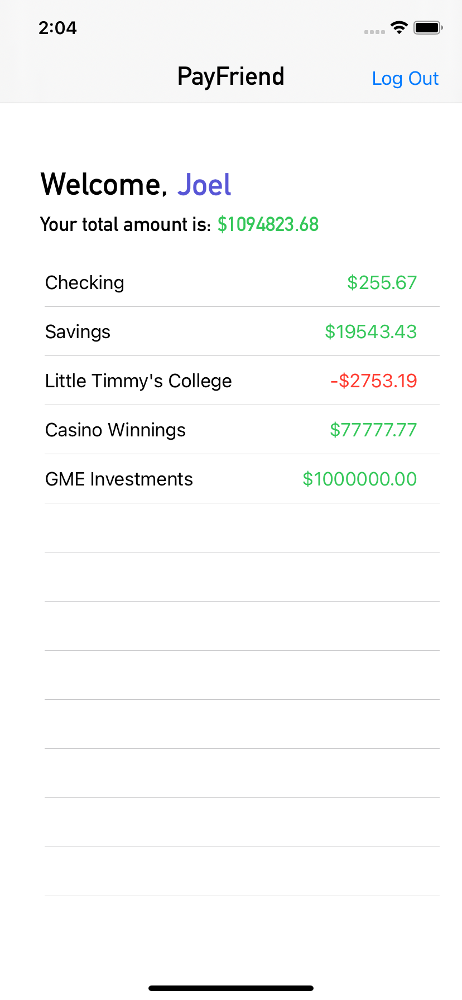

# ECS 189E WQ 2021 Homework 3
Joel Boersma - 914845830

## Description
This project tasked us with expanding on the cryptocurrency wallet app that we have been working on all quarter by

1. Modifying our OTP text field to support all kinds of partial deletion and partial entering,
2. Modifying the home view into a wallet view that displays the user's username, accounts, and total funds in said accounts, while allowing the user to update their username, and
3. Simplifying the login process of last logged-in user by...
    - Showing their phone number in the phone number text field on the login view upon starting the app
    - Allowing them to bypass the verification view

## Implementation

### OTP Text Field

In my rendition of the previous assignment, the OTP Text Field was implemented through two classes: `OTPView`, which inherits from `UIStackView`, and `OTPTextField`, which inherits from `UITextField`. The `OTPView` acted as a container for all the `OTPTextField`s and contained basically all the methods for the implementation.

In this assignment, the OTP Text Field utilizes a delegate, and thus a third class was introduced: `OTPTextFieldDelegate`, which inherits from `UITextFieldDelegate`. In addition, `OTPView` inherits from `OTPTextFieldDelegate`, as the single `OTPView` acts as the delegate for each of the `OTPTextField`s.

The delegate listens for three events: 

* `didPressBackspace()`: When the user presses backspace. When this function is called, it will update which text fields are editable, update the text within all six text fields to accurately reflect the current code, and update the current text field in focus to be the previous field.
* `textFieldDidBeginEditing()`: When the user begins editing in a text field. When this function is called, it will set the current text field to be the text field that the user tapped on and set the cursor to be at the end of the text field.
* `textFieldDidChangeSelection()`: When the user changes the selection within a text field. This function will reset the position to be at the end of the text field. This is so that the selection within a text field will always be at the end.

Many other things changed with `OTPView` and `OTPTextField` under the hood. For instance, each `OTPTextField` now has an ID and relies on `nextField` and `prevField` pointers for traversal between each field.

Another change is that, occasionally, the text within all the text fields is reduced to a single string, and then the characters of that string are redistributed within each text field so that each one contains at most one character. This occurs on two occasions: when backspace is pressed (where otherwise a text field would be empty) and when adding characters in the middle of the code (where otherwise multiple characters would exist within one text field).

One problem that occurred with this change was that the `moveCursor` method would be called any time a text field's contents were updated computationally instead of only being called when the contents were updated the by the user. To solve this, a simple lock was implemented: `isBusy`. When a method in `OTPView` is called that will modify the contents of the `OTPTextField`s, `isBusy` is set to `true`, and at the end of the method, `isBusy` is set to `false`. Additionally, `moveCursor` will immediately return any time `isBusy` is set to true. Together, these two changes ensure that `moveCursor` will only run when the contents of a text field are changed by the user.

### Updated Home View
The updated home view, also called the wallet view, displays the user's name, their accounts (each with name and amount), and the their total across all their accounts.

Before this view is loaded, the wallet info for the logged-in user is retrieved from the server. As the view is instantiated, this wallet info is placed into the view's `wallet` variable before the view is loaded.

The wallet view incorporates a `UITableView` called `accountsTableView` to display the user's various accounts. Each cell is of the `value1` style, which has its primary label left-aligned on the left and its detail label right-aligned on the right. The primary label, in this case, displays the account's name, and the detail label displays the amount in the account.

The `UITableViewDataSource` for `accountsTableView` is set to the `HomeView` itself because it are simply displaying data from the `wallet` object.

This table view has only one section, so each of the `UITableViewDataSource` functions `assert`s that the section is equal to 0.

To support both positive and negative dollar amounts, all labels that display a dollar amount in this view (the tableview detail labels and the total amount label) are run through the `displayDollarAmountInLabel` method, which modifies the text and color of the label. The label text will always display the amount with two decimal places and a dollar sign in front. If the amount to displayed in the label is negative, the negative symbol will be placed before the dollar sign instead of between the dollar sign and amount. Additionally, positive values will have their label color be green, while negative and zero values will have their label color be red.

The username is displayed in a `UITextField`. Tapping on it allows the user to update their username. If the user has not set a username, or sets it to the empty string, the user's E164 phone number will be displayed instead.

When the user stops editing the text field by tapping anywhere else on the screen, the API's `setName` method is called, which will store the name on the API's server. If this is successful, then a label that says "Username saved!" is displayed for 3 seconds.

The home view has a "Log Out" button on the right side of the navigation bar that will return the uesr to the login view.

### Simplifying the Login Process

The login process has been simplified for the last logged-in user. When a user successfully logs in, their E164 phone number and auth code are stored on the device using the `Storage` class. Any time the login view is shown, it will check to see if there is a valid E164 phone number stored on the device and, if there is, will reformat it to national number format and display it in the phone number text field.

If the next button is pushed and the entered phone number is the same as the phone number in storage, then the navigation controller will bypass verification and go straight to the home view.

### Navigation

With the recent additions for views and the paths between them, it is important to lay out the possible navigation paths.

Beginning with the login view, if the current user is also the last user that was logged in, then upon entering their phone number and hitting the "Next" button, they will be taken to the home view. 

If the user is different from the user that was previously logged in, then after entering their phone number and hitting the "Next" button, they will be taken to the verification view. The user can then either press the back button to return to the login view or enter a valid code to be taken to the home view.

From the home view, the user can click the "Log Out" button to be taken to the login view.
